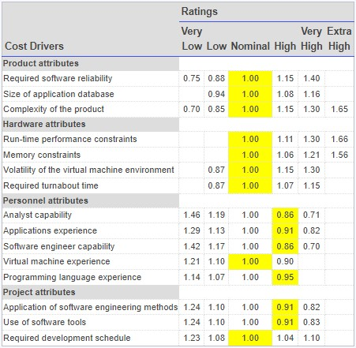

## Case Study

**1. A Library Information System for SE VLabs Institute**

The SE VLabs Institute has been recently setup to provide state-of-the-art research facilities in the field of Software Engineering. Apart from research scholars (students) and professors, it also includes quite a large number of employees who work on different projects undertaken by the institution.

As the size and capacity of the institute is increasing with the time, it has been proposed to develop a Library Information System (LIS) for the benefit of students and employees of the institute. LIS will enable the members to borrow a book (or return it) with ease while sitting at his desk/chamber. The system also enables a member to extend the date of his borrowing if no other booking for that particular book has been made. For the library staff, this system aids them to easily handle day-to-day book transactions. The librarian, who has administrative privileges and complete control over the system, can enter a new record into the system when a new book has been purchased, or remove a record in case any book is taken off the shelf. Any non-member is free to use this system to browse/search books online. However, issuing or returning books is restricted to valid users (members) of LIS only.

The final deliverable would a web application (using the recent HTML 5), which should run only within the institute LAN. Although this reduces security risk of the software to a large extent, care should be taken no confidential information (eg., passwords) is stored in plain text.

The SE VLabs Institute has a IT management team of it's own. This team has been given the task to execute the Library Information System project. The team consists of a few experts from industry, and a batch of highly qualified engineers experienced with design and implementation of information systems. It is planned that the current project will be undertaken by a small team consisting of one expert and few engineers. Actual team composition would be determined in a later stage.

Using COCOMO and based on the team size (small) and experience (high), the concerned project could be categorized as "organic". The experts, based on their prior experience, suggested that the project size could roughly be around 10 KLOC. This would serve as the basis for estimation of different project parameters using basic COCOMO, as shown below:

$$ Effort = a * (KLOC)^b \ PM $$
$$ Tdev = 2.5 * (Effort)^c \ Months $$

For organic category of project the values of a, b, c are 2.4, 1.05, 0.38 respectively. So, the projected effort required for this project becomes

$$ Effort = 2.4 * (10)^{1.05} \ PM $$
         =  27 PM  (approx)  

So, around 27 person-months are required to complete this project. With this calculated value for effort we can also approximate the development time required:

$$ Tdev = 2.5 * (27)^{0.38} \ Months $$
         = 8.7 Months (approx)

So, the project is supposed to be complete by nine months. However, estimations using basic COCOMO are largely idealistic. Let us refine them using intermediate COCOMO. Before doing so we determine the Effort Adjustment Factor (EAF) by assigning approprite weight to each of the following attributes.

The cells with yellow backgrounds highlight our choice of weight for each of the cost drivers. EAF is determined by multiplying all the chosen weights. So, we get

EAF = 0.53 (approx)

Using this EAF value we refine our estimates from basic COCOMO as shown below

    Effort|corrected = Effort * EAF 
                    = 27 * 0.53
                    = 15 PM (approx)
    Tdev|corrected = 2.5 * (Effort|corrected)^c
                  = 2.5 * (15)^0.38
                  = 7 months (approx)
                  
After refining our estimates it seems that seven months would likely be sufficient for completion of this project. This is still a rough estimate since we have not taken the underlying components of the software into consideration. Complete COCOMO model considers such parameters to give a more realistic estimate.

