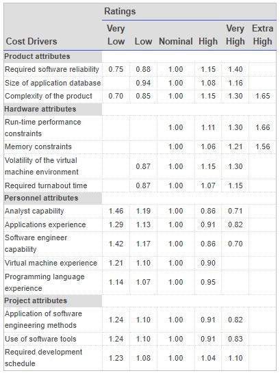
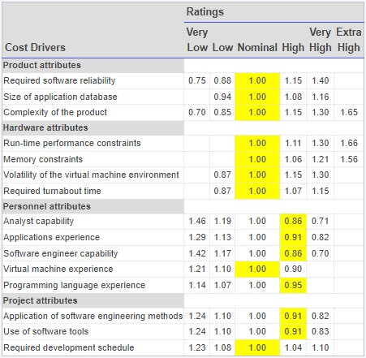

## Introduction 

After gathering the entire requirements specific to software project usually we need to think about different solution strategy for the project. Expert business analysts are analyzing their benefits and as well as their shortcomings by means of cost, time and resources require to develop it.

In this experiment, we will learn how to estimate cost, effort and duration for a software project, and then select one solution approach which will be found suitable to fulfill the organizational goal.

## Theory

### Project Estimation Techniques

A software project is not just about writing a few hundred lines of source code to achieve a particular objective. The scope of a software project is comparatively quite large, and such a project could take several years to complete. However, the phrase "quite large" could only give some (possibly vague) qualitative information. As in any other science and engineering discipline, one would be interested to measure how complex a project is. One of the major activities of the project planning phase, therefore, is to estimate various project parameters in order to take proper decisions. Some important project parameters that are estimated include:

- **Project size:** What would be the size of the code written say, in number of lines, files, modules?
- **Cost:** How much would it cost to develop a software? A software may be just pieces of code, but one has to pay to the managers, developers, and other project personnel.
- **Duration:** How long would it be before the software is delivered to the clients?
- **Effort:** How much effort from the team members would be required to create the software?

In this experiment we will focus on two methods for estimating project metrics: COCOMO and Halstead's method.

### COCOMO
COCOMO (Constructive Cost Model) was proposed by Boehm. According to him, there could be three categories of software projects: organic, semidetached, and embedded. The classification is done considering the characteristics of the software, the development team and environment. These product classes typically correspond to application, utility and system programs, respectively. Data processing programs could be considered as application programs. Compilers, linkers, are examples of utility programs. Operating systems, real-time system programs are examples of system programs. One could easily apprehend that it would take much more time and effort to develop an OS than an attendance management system.

The concept of organic, semidetached, and embedded systems are described below.

- **Organic:** A development project is said to be of organic type, if
  - The project deals with developing a well understood application
  - The development team is small
  - The team members have prior experience in working with similar types of projects
- **Semidetached:** A development project can be categorized as semidetached type, if
  - The team consists of some experienced as well as inexperienced staff
  - Team members may have some experience on the type of system to be developed
- **Embedded:** Embedded type of development project are those, which
  - Aims to develop a software strongly related to machine hardware
  - Team size is usually large

  Boehm suggested that estimation of project parameters should be done through three stages: Basic COCOMO, Intermediate COCOMO, and Complete COCOMO.

  ### Basic COCOMO Model

The basic COCOMO model helps to obtain a rough estimate of the project parameters. It estimates effort and time required for development in the following way:

<!-- $$ Effort = a * (KDSI)^b \ PM $$
$$ Time = c (Effort)^d $$
$$ Tdev= 2.5 * (Effort)^c \ Months $$
$$ Person \ required= Effort/time $$ -->

Effort = a * (KDSI)^b  PM  
Tdev= 2.5 * (Effort)^c  Months  
Person required= Effort/Tdev 

where,

- KDSI is the estimated size of the software expressed in Kilo Delivered Source Instructions 
- a, b, c are constants determined by the category of software project  
- Effort denotes the total effort required for the software development, expressed in person months (PMs)  
- Tdev denotes the estimated time required to develop the software (expressed in months)  
- The value of the constants a, b, c are given below:

Software Project | a | b | c
:--|:--|:--|:--|
Organic | 2.4 | 1.05 |  0.38 |
Semi-detached | 3.0 | 1.12 |  0.35  |
Embedded | 3.6| 1.20 |  0.32|

### Intermediate COCOMO Model
The basic COCOMO model considers that effort and development time depends only on the size of the software. However, in real life there are many other project parameters that influence the development process. The intermediate COCOMO take those other factors into consideration by defining a set of 15 cost drivers (multipliers) as shown in the table below [i]. Thus, any project that makes use of modern programming practices would have lower estimates in terms of effort and cost. Each of the 15 such attributes can be rated on a six-point scale ranging from "very low" to "extra high" in their relative order of importance. Each attribute has an effort multiplier fixed as per the rating. The product of effort multipliers of all the 15 attributes gives the **Effort Adjustment Factor (EAF).**

Cost drivers for Intermediate COCOMO 
[http://en.wikipedia.org/wiki/COCOMO](http://en.wikipedia.org/wiki/COCOMO)

EAF is used to refine the estimates obtained by basic COCOMO as follows:

<!-- $$ Effort|_{corrected} = Effort * EAF $$

$$ Tdev|_{corrected} = 2.5 * (Effort|_{corrected})^c $$
 -->

 
<!-- $$
\begin{align*}
Effort|_{corrected} = Effort * EAF
\end{align*}
$$
 -->
Effort|corrected = Effort * EAF

Tdev|corrected = 2.5 * ( Effort|corrected) ^ c

### Complete COCOMO Model

Both the basic and intermediate COCOMO models consider a software to be a single homogeneous entity -- an assumption, which is rarely true. In fact, many real life applications are made up of several smaller sub-systems. (One might not even develop all the sub-systems -- just use the available services). The complete COCOMO model takes these factors into account to provide a far more accurate estimate of project metrics.

To illustrate this, consider a very popular distributed application: the ticket booking system of the Indian Railways. There are computerized ticket counters in most of the railway stations of our country. Tickets can be booked / cancelled from any such counter. Reservations for future tickets, cancellation of reserved tickets could also be performed. On a high level, the ticket booking system has three main components:

- Database
- Graphical User Interface (GUI)
- Networking facilities

Among these, development of the GUI is considered as an organic project type; the database module could be considered as a semi-detached software. The networking module can be considered as an embedded software. To obtain a realistic cost, one should estimate the costs for each component separately, and then add it up.

### Advantages of COCOMO

COCOMO is a simple model, and should help one to understand the concept of project metrics estimation.

### Drawbacks of COCOMO
COCOMO uses KDSI, which is not a proper measure of a program's size. Indeed, estimating the size of a software is a difficult task, and any slight miscalculation could cause a large deviation in subsequent project estimates. Moreover, COCOMO was proposed in 1981 keeping the waterfall model of project life cycle in mind. It fails to address other popular approaches like prototype, incremental, spiral, agile models. Moreover, in present day a software project may not necessarily consist of coding of every bit of functionality. Rather, existing software components are often used and glued together towards the development of a new software. COCOMO is not suitable in such cases.

COCOMO II was proposed later in 2000 to many of address these issues.

### Halstead's Complexity Metrics
Halstead took a linguistic approach to determine the complexity of a program. According to him, a computer program consists of a collection of different operands and operators. The definition of operands and operators could, however, vary from one person to another and one programming language to other. Operands are usually the implementation variables or constants -- something upon which an operation could be performed. Operators are those symbols that affects the value of operands. Halstead's metrics are computed based on the operators and operands used in a computer program. Any given program has the following four parameters:

- **n1:** Number of unique operators used in the program
- **n2:** Number of unique operands used in the program
- **N1:** Total number of operators used in the program
- **N2:** Total number of operands used in the program

Using the above parameters one compute the following metrics:

- **Program Length:** N = N1 + N2
- **Program Vocabulary:** n = n1 + n2
- **Volume:** V = N * lg n
- **Difficulty:** D = (n1 * N2) / (2 * n2)
- **Effort:** E = D * V
- **Time to Implement:** T = E / 18 (in seconds) 

The program volume V is the minimum number of bits needed to encode the program. It represents the size of the program while taking into account the programming language.
The difficulty metric indicates how difficult a program is to write or understand.
Effort denotes the "mental effort" required to develop the software, or to recreate the same in another programming language [4].

## Case Study

1. **A Library Information System for SE VLabs Institute**

The SE VLabs Institute has been recently setup to provide state-of-the-art research facilities in the field of Software Engineering. Apart from research scholars (students) and professors, it also includes quite a large number of employees who work on different projects undertaken by the institution.

As the size and capacity of the institute is increasing with the time, it has been proposed to develop a Library Information System (LIS) for the benefit of students and employees of the institute. LIS will enable the members to borrow a book (or return it) with ease while sitting at his desk/chamber. The system also enables a member to extend the date of his borrowing if no other booking for that particular book has been made. For the library staff, this system aids them to easily handle day-to-day book transactions. The librarian, who has administrative privileges and complete control over the system, can enter a new record into the system when a new book has been purchased, or remove a record in case any book is taken off the shelf. Any non-member is free to use this system to browse/search books online. However, issuing or returning books is restricted to valid users (members) of LIS only.

The final deliverable would a web application (using the recent HTML 5), which should run only within the institute LAN. Although this reduces security risk of the software to a large extent, care should be taken no confidential information (eg., passwords) is stored in plain text.

The SE VLabs Institute has a IT management team of it's own. This team has been given the task to execute the Library Information System project. The team consists of a few experts from industry, and a batch of highly qualified engineers experienced with design and implementation of information systems. It is planned that the current project will be undertaken by a small team consisting of one expert and few engineers. Actual team composition would be determined in a later stage.

Using COCOMO and based on the team size (small) and experience (high), the concerned project could be categorized as "organic". The experts, based on their prior experience, suggested that the project size could roughly be around 10 KLOC. This would serve as the basis for estimation of different project parameters using basic COCOMO, as shown below:

$$ Effort = a * (KLOC)^b \ PM $$
$$ Tdev = 2.5 * (Effort)^c \ Months $$

For organic category of project the values of a, b, c are 2.4, 1.05, 0.38 respectively. So, the projected effort required for this project becomes

$$ Effort = 2.4 * (10)^{1.05} \ PM $$
         =  27 PM  (approx)  

So, around 27 person-months are required to complete this project. With this calculated value for effort we can also approximate the development time required:

$$ Tdev = 2.5 * (27)^{0.38} \ Months $$
         = 8.7 Months (approx)

So, the project is supposed to be complete by nine months. However, estimations using basic COCOMO are largely idealistic. Let us refine them using intermediate COCOMO. Before doing so we determine the Effort Adjustment Factor (EAF) by assigning approprite weight to each of the following attributes.

The cells with yellow backgrounds highlight our choice of weight for each of the cost drivers. EAF is determined by multiplying all the chosen weights. So, we get

EAF = 0.53 (approx)

Using this EAF value we refine our estimates from basic COCOMO as shown below

    Effort|corrected = Effort * EAF 
                    = 27 * 0.53
                    = 15 PM (approx)
    Tdev|corrected = 2.5 * (Effort|corrected)^c
                  = 2.5 * (15)^0.38
                  = 7 months (approx)
                  
After refining our estimates it seems that seven months would likely be sufficient for completion of this project. This is still a rough estimate since we have not taken the underlying components of the software into consideration. Complete COCOMO model considers such parameters to give a more realistic estimate.

